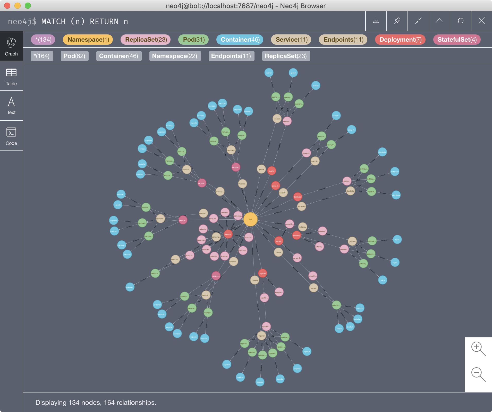

# kubectl-graph

[](#status)
[](https://github.com/steveteuber/kubectl-graph/blob/master/LICENSE)
[](https://goreportcard.com/report/github.com/steveteuber/kubectl-graph)
[](https://github.com/steveteuber/kubectl-graph/actions?query=workflow:Release)
[](https://github.com/steveteuber/kubectl-graph/blob/master/go.mod#L3)
[](https://github.com/steveteuber/kubectl-graph/releases/latest)

A kubectl plugin to visualize Kubernetes resources and relationships.

## Quickstart

This quickstart guide uses [homebrew](https://brew.sh) on `macOS`.

### Prerequisites

This plugin requires [Graphviz](https://graphviz.org) *or* [Neo4j](https://neo4j.com) to visualize the dependency graph.

#### Graphviz

To install the `dot` command line utility:

```
brew install graphviz
```

#### Neo4j

To install the `cypher-shell` command line utility and the `Neo4j Desktop.app`:

```
brew install cypher-shell
brew cask install neo4j
```

### Installation

This `kubectl` plugin is distributed via [krew](https://krew.sigs.k8s.io).
To install it, run the following command:

```
kubectl krew install graph
```

## Examples

### Grafana Loki

Loki is a horizontally-scalable, highly-available, multi-tenant log aggregation system inspired by Prometheus.



```
kubectl graph all -n loki -o cypher | cypher-shell -u neo4j -p secret
```

## Status

This `kubectl` plugin is under active development.

## License

This project is licensed under the Apache License 2.0, see [LICENSE](./LICENSE) for more information.
