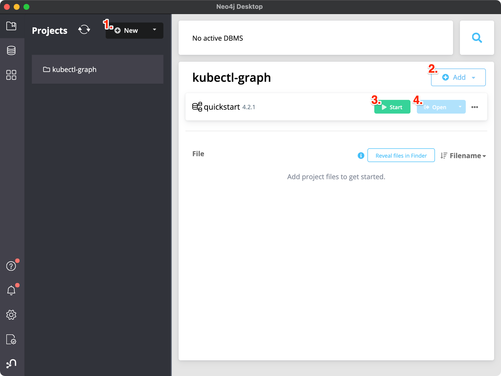

# kubectl-graph

[](https://github.com/steveteuber/kubectl-graph/blob/master/LICENSE)
[](https://goreportcard.com/report/github.com/steveteuber/kubectl-graph)
[](https://github.com/steveteuber/kubectl-graph/actions?query=workflow:Release)
[](https://github.com/steveteuber/kubectl-graph/issues)
[](https://github.com/steveteuber/kubectl-graph/blob/master/go.mod#L3)
[](https://github.com/steveteuber/kubectl-graph/releases/latest)

A kubectl plugin to visualize Kubernetes resources and relationships.

## Prerequisites

This plugin requires [Graphviz](https://graphviz.org), [Neo4j](https://neo4j.com) *or* [ArangoDB](https://www.arangodb.com) to visualize the dependency graph.

<details>
<summary><strong>Graphviz</strong></summary><br>

The *default* output format requires `dot` to convert the output into a useful format.

```
brew install graphviz
```
</details>

<details>
<summary><strong>Neo4j</strong></summary><br>

The *CQL* output format requires `cypher-shell` to connect to a Neo4j database.

```
brew install cypher-shell
```
</details>

<details>
<summary><strong>ArangoDB</strong></summary><br>

The *AQL* output format requires `curl` and `jq` to send API requests to an ArangoDB server.

```
brew install curl jq
```
</details>

## Installation

This `kubectl` plugin is distributed via [krew](https://krew.sigs.k8s.io). To install it, run the following command:

```
kubectl krew install graph
```

## Usage

In general, this plugin is working like `kubectl get` but it tries to resolve relationships between the Kubernetes
resources before it prints a graph in `AQL`, `CQL` *or* `DOT` format. By default, the plugin will use `DOT` as output format.

```
kubectl graph [(-o|--output=)aql|arangodb|cql|cypher|dot|graphviz] (TYPE[.VERSION][.GROUP] ...) [flags]
```

## Quickstart

This quickstart guide uses macOS. It's possible that the commands can differ on other operating systems.

### Graphviz

When you have installed the `dot` command line tool, then you can start to fetch all running Pods in the
`kube-system` namespace and pipe the output directly to the `dot` command.

```
kubectl graph pods --field-selector status.phase=Running -n kube-system | dot -T svg -o pods.svg
```

Now you will have a `pods.svg` file in the current working directory, which can be viewed with any web browser:

```
open pods.svg
```

If you're not happy with SVG as output format, please take a look at the offical [documentation](https://graphviz.org/doc/info/output.html).

### Neo4j

Before you can import all your Kubernetes resources, you will need to create a Neo4j database.
This can be done in multiple ways and is based on your preference.

<details>
<summary><strong>Docker</strong></summary><br>

[Docker](https://docs.docker.com/get-started/) is the easiest way to get started with a Neo4j server and an empty database.

```
docker run --rm -p 7474:7474 -p 7687:7687 -e NEO4J_AUTH=neo4j/secret neo4j
```

When the container is up and running then you can open the Neo4j Browser interface at http://localhost:7474/.
</details>

<details>
<summary><strong>Neo4j Desktop</strong></summary><br>

The [Neo4j Desktop](https://neo4j.com/developer/neo4j-desktop/) application lets you easily create any number of local databases.

```
brew install --cask neo4j
```

After installation, open the `Neo4j Desktop.app` and do the following steps:

1. Create a new project and give it a name.
2. Create a new local DBMS with a name like `quickstart` and password `secret`.
3. Click Start and enter the password.
4. When the database is up and running then you can click Open to open the Neo4j Browser interface.


</details>

When you have opened the Neo4j Browser interface, then you can start to fetch all resources in the
`kube-system` namespace and pipe the output directly to the `cypher-shell` command.

```
kubectl graph all -n kube-system -o cypher | cypher-shell -u neo4j -p secret
```

Finally, within the Neo4j Browser interface you can enter the following queries in the command line:

```
MATCH (n) RETURN n         // Render all nodes as a visual graph
MATCH (n) DETACH DELETE n  // Delete all nodes and relationships
```

For more information about the Cypher query language, please take a look at the offical [documentation](https://neo4j.com/docs/cypher-manual/current/clauses/).

### ArangoDB

Before you can import all your Kubernetes resources, you will need to create an ArangoDB database.
This can be done in multiple ways and is based on your preference.

<details>
<summary><strong>Docker</strong></summary><br>

[Docker](https://docs.docker.com/get-started/) is the easiest way to get started with an ArangoDB server and an empty database.

```
docker run --rm -p 8529:8529 -e ARANGO_NO_AUTH=1 arangodb
```

When the container is up and running then you can open the ArangoDB Browser interface at http://localhost:8529/.
</details>

If you start with an empty database you need to create two collections one for resources and one for relationships.

```
curl http://localhost:8529/_api/collection -d '{"type": 2, "name": "resources"}'
curl http://localhost:8529/_api/collection -d '{"type": 3, "name": "relationships"}'
```

After that you also need to create a graph which requires the name and a definition of its edges.

```
curl http://localhost:8529/_api/gharial -d @- <<EOF
  {"name": "quickstart", "edgeDefinitions": [
    {"collection": "relationships", "from": ["resources"], "to": ["resources"]}
  ]}
EOF
```

Finally, when you created the two collections then you can start to fetch all resources in the 
`kube-system` namespace and pipe the output directly to the ArangoDB HTTP API endpoint.

```
kubectl graph all -n kube-system -o aql \
  | eval 'jq -n --arg stdin "$(cat)" "{query:\$stdin}"' \
  | curl http://localhost:8529/_api/cursor -d @-
```

For more information about the HTTP API, please take a look at the offical [documentation](https://www.arangodb.com/docs/stable/http/).

## Examples

### Grafana Loki

Loki is a horizontally-scalable, highly-available, multi-tenant log aggregation system inspired by Prometheus.


```
kubectl graph all -n loki -o cypher | cypher-shell -u neo4j -p secret
```

## Development

If you wish to work on the plugin, you'll first need [Go](http://www.golang.org/) installed on your machine
and then you can simply run the following command to test your changes:

```
go run ./cmd/kubectl-graph/main.go all -n <namespace> | dot -T png -o all.png
```

## License

This project is licensed under the Apache License 2.0, see [LICENSE](./LICENSE) for more information.
